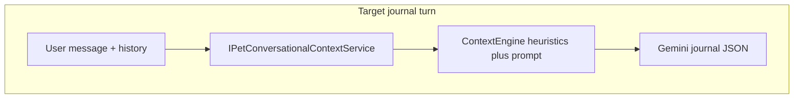
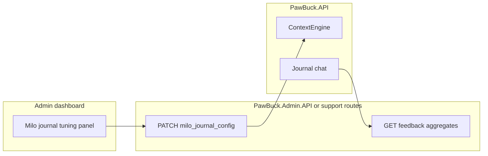

# Contextual journal engine (Milo) — comprehensive plan

## Product goals

- Move from a **fixed or generic sequence** of journal questions to **context-aware, human-like follow-ups** driven by **this pet’s** profile and **authorized** records.
- The assistant behaves as a **Proactive Pet Care Partner**: one warm, conversational question (or short follow-up) that **anchors on real data** (recent vaccine, new med, last journal note, upcoming due date)—not a script.
- **Never** open with vacuous lines like **“How can I help?”**; tie the first assistant turn to **prioritized context** and the user’s message.
- Avoid AI-isms (“I have analyzed your data”); prefer **“I was thinking about…”**, **“Since you mentioned…”**, **“With [event] coming up…”**.

## Technical goals

- **Single integration hub:** all aggregation and Gemini journal calls stay in **PawBuck.API** ([`MiloReasoningService`](backend/PawBuck.API/Services/MiloReasoningService.cs)); no full Milo logic in Supabase Edge ([`docs/ARCHITECTURE.md`](docs/ARCHITECTURE.md)).
- **One Gemini call per journal turn** (same JSON schema as today: `answer`, `suggestedReplies`, `journalSessionComplete`), extended with **`responseId`**, **`promptVersion`**, and optional **`heuristicTags`** for feedback correlation.
- **Deterministic “reasoning”** for *priority* (which threads matter most) lives in **`ContextEngine`** (C# rules) with **admin-configurable** thresholds; the **LLM** turns context + hints into natural language.
- **Feedback loop:** thumbs up/down persisted per response; **admin** views aggregates to steer prompts and config; v1 = **operational** iteration, not automatic Gemini fine-tuning unless separately approved.

## Current behavior (repo)

| Area | Behavior |
|------|----------|
| Journal mode | [`ChatAsync`](backend/PawBuck.API/Services/MiloReasoningService.cs) → `RunJournalInterviewAsync` only; **no** `RunPlanStepAsync` / `FetchFactsByKindsAsync`. |
| Prompt input | [`BuildPetContextPrompt`](backend/PawBuck.API/Services/MiloReasoningService.cs): name, species, breed, age, sex, weight only. |
| General Milo chat | Plan → [`FetchFactsByKindsAsync`](backend/PawBuck.API/Services/MiloReasoningService.cs) (vaccinations, meds, labs, exams, health summary) → answer step. |
| Client | [`fetchMiloChat`](apps/consumer-app/utils/miloChatApi.ts) with `journalMode: true`; [`milo.tsx`](apps/consumer-app/app/(home)/milo.tsx) persists logs after `journalSessionComplete`. |
| Offline | [`miloJournalOffline.ts`](apps/consumer-app/utils/miloJournalOffline.ts): fixed 3-step script when API fails. |

## Target architecture

### 1. Context aggregator — `getPetConversationalContext` → **`IPetConversationalContextService`**

**Method:** `Task<PetConversationalContextDto?> GetPetConversationalContextAsync(Guid userId, Guid petId, CancellationToken)`

Always scope by **`userId` + `petId`** (same ownership model as [`IMiloPetFactsService.VerifyPetOwnershipAsync`](backend/PawBuck.API/Services/IMiloPetFactsService.cs)). Return `null` if pet missing or not owned.

**Payload shape (JSON-serializable for prompts or logging):**

- **`petProfile`:** name, species, breed, DOB, computed `ageYears` / display string, `isSenior` (e.g. ≥ 8 years), sex, weight.
- **`recentMedicalHistory` (last 14 days, UTC date boundaries):**
  - Vaccinations: `public.vaccinations` where `date` in window.
  - Medications started: `public.medicines` where `COALESCE(start_date, created_at::date)` in window; `type` = `medication_started`.
  - Surgeries / major procedures: `public.clinical_exams` where `exam_date` in window and `exam_type` matches ILIKE patterns (e.g. surgery, spay, neuter, dental, extract—tune to product).
- **`recentJournalNotes`:** last **3** rows from `public.pet_journal_entries` (`domain`, `subtype`, `note`, `entry_date`, `created_at`), ordered by `created_at DESC`.
- **`upcomingMilestones` (next 30 days):**
  - Vaccinations: `next_due_date` in range.
  - Exams: `follow_up_date` from `clinical_exams` in range.
  - Optional: `vet_bookings` with `start_utc` in range (exclude cancelled if applicable).

**Note:** This **supersedes** the earlier sketch of only `GetJournalContextBriefAsync` on `IMiloPetFactsService`—one dedicated service keeps the JSON shape and journal-specific windows explicit; avoid duplicating two parallel “brief” APIs.

### 2. **`ContextEngine` (static)**

Responsibilities:

1. **`EvaluateHeuristicGuidance(PetConversationalContextDto)`** — ordered hint strings for the system prompt, e.g.:
   - Recent **vaccination** with event date **&lt; 3 days ago** → prioritize **post-vaccine comfort** (mild soreness, energy, appetite)—not diagnosis.
   - **New medication** (e.g. started within **7 days** per product) → **efficacy / tolerance** framing (how things seem since starting), not dosing changes.
   - **Limping** signal in journal text (`note` / `subtype`) within **48 hours** → **mobility** follow-up.
   - **Senior** (`isSenior`) and **no journal activity** in last **7 days** (configurable) → gentle **energy / comfort** check.
   - **Upcoming milestone** within window → light **preparation** or “how are they doing ahead of …” without sounding alarmist.

2. **`FormatContextForPrompt(PetConversationalContextDto)`** — compact, human-readable sections for the LLM (avoid dumping raw JSON in the prompt unless you add a separate debug mode).

3. **`BuildProactiveJournalSystemPrompt(petName, existingProfileBlock, PetConversationalContextDto)`** — combines:
   - Persona: **Proactive Pet Care Partner**.
   - Constraints: no generic “How can I help?”; no “I analyzed your data”; use pet’s name naturally; **one** warm question when appropriate; keep existing safety rules from [`RunJournalInterviewAsync`](backend/PawBuck.API/Services/MiloReasoningService.cs) (no diagnose/prescribe, emergency escalation, JSON output schema unchanged).
   - Injected blocks: profile text + formatted context + **numbered priority hints** from heuristics.

### 3. **`MiloReasoningService` integration**

- After `petOwned` is true and `request.JournalMode`, load `PetConversationalContextDto` (skip if null—fall back to profile-only prompt with degraded behavior).
- Replace or extend the current `journalSystem` string so it uses **`ContextEngine.BuildProactiveJournalSystemPrompt`** (still **one** `generateContent` with structured JSON output).
- Set **`UsedPetData = true`** when the snapshot contains meaningful rows (or whenever service returns non-null and pet verified).

### 4. Consumer app

- **No API contract change** required if request body stays [`MiloChatRequest`](backend/PawBuck.API/Models/MiloChatModels.cs).
- **Optional:** pass [`params.context`](apps/consumer-app/app/(home)/milo.tsx) into the user message prefix so the model anchors “why they opened journal.”

### 5. Offline fallback

- [`miloJournalOffline.ts`](apps/consumer-app/utils/miloJournalOffline.ts) remains a **degraded** path; optional small improvement using existing `triageCtx` (allergies/conditions)—**not** blocking for server-side contextual engine.

### 6. Tests

- **Unit tests** for `ContextEngine` (fixed `DateTime` or injectable “now” via test doubles if you refactor clock): vaccination window, limping text, senior + quiet journal, medication window.
- **Guard:** ownership still enforced before loading context; do not log full health blobs at Information level.

### 7. Compliance / operations

- Align health-data handling with [`docs/COMPLIANCE-BACKLOG.md`](docs/COMPLIANCE-BACKLOG.md) expectations; no new collection without product/legal review.
- Log only aggregates (e.g. “context rows loaded”) at normal levels, not full PHI.

### 8. Admin app — configuration and “training” loop

**Goal:** Tune contextual journaling **without shipping new binaries** for every copy tweak, and **measure** what works using aggregated feedback—so product/engineering can iterate prompts, thresholds, and persona rules based on **real-time** outcomes.

**Where it lives (repo patterns):**

- **Admin dashboard** already talks to PawBuck via [`admin-dashboard/src/api/supportClient.ts`](admin-dashboard/src/api/supportClient.ts) and panels like [`FeatureGatesPanel.tsx`](admin-dashboard/src/components/FeatureGatesPanel.tsx) and [`MiloClassifyHarness.tsx`](admin-dashboard/src/components/MiloClassifyHarness.tsx). Extend the same pattern: **admin-only** endpoints (or **PawBuck.Admin.API**) for read/update of journal config and read-only **feedback aggregates**.
- **Avoid** putting secret keys or model training in the admin SPA; config is **non-secret** tuning (numbers, feature flags, prompt version id).

**Configurable knobs (v1 suggestions — store in Postgres row or JSON column, e.g. `milo_journal_config` single row or keyed by `environment`):**

| Knob | Purpose |
|------|--------|
| `recentMedicalWindowDays` | Default 14; widen/narrow “recent events” for context. |
| `upcomingMilestoneWindowDays` | Default 30. |
| `recentJournalNotesCount` | Default 3. |
| `seniorAgeYears` | Default 8; drives senior heuristic. |
| `postVaccineFocusDays` | Default 3; “active” vaccine window for side-effect follow-ups. |
| `newMedicationFocusDays` | Default 7; efficacy/tolerance framing. |
| `limpingLookbackHours` | Default 48. |
| `quietJournalDays` | Default 7; senior + no notes heuristic. |
| `surgeryExamTypePatterns` | Text array or CSV; ILIKE patterns for clinical_exams. |
| `promptVersion` / `personaVariant` | Opaque id returned on chat responses so feedback and analytics tie to **which** prompt pack was used. |
| `temperature` / `maxOutputTokens` (optional) | Journal-only; if exposed, guard with min/max bounds in API. |

**Implementation notes:**

- **`ContextEngine`** reads **`IMiloJournalConfig`** (cached from DB with short TTL or reload on admin save) instead of hard-coded constants.
- **Admin UI:** new panel **“Milo journal tuning”** — form fields for the above, save → PATCH admin API → update row; **read-only** “Preview” of effective config JSON for support.
- **“Training”** in v1 means **operational learning**: weekly review of **like rate** and **dislike spikes** by `promptVersion` and **heuristic tag** (e.g. `post_vaccine`, `senior_check_in`), then **manual** prompt/threshold edits. **True ML fine-tuning** of Gemini (or a small ranker) is **out of scope** for this plan unless product/legal approves a separate pipeline.

### 9. User feedback — like / dislike (critical)

**Goal:** Capture **binary sentiment** on each assistant reply so you can **fine-tune the system** in the product sense: which prompts and heuristics feel helpful vs. annoying.

**UX (consumer):**

- After each assistant message in journal Milo chat, show **thumbs up / thumbs down** (no mandatory free text in v1; optional “Tell us more” later).
- One tap submits feedback; **idempotent** optional: user can change vote once.

**Data model (sketch — new migration under `supabase/migrations/`):**

- Table e.g. `milo_journal_message_feedback` (or generic `milo_feedback` with `surface = journal`):
  - `id`, `user_id`, `pet_id` (nullable if anonymous surface not used), `created_at`
  - `rating`: `up` | `down` (or boolean `is_positive`)
  - `response_id` (uuid) — **must match** `MiloChatResponse` field returned from `/api/milo/chat` so the row links to **one** server turn without storing full assistant text in the row (reduces PHI in feedback table; optional **hash** of answer for dedupe analytics only).
  - `prompt_version`, `heuristic_tags` (text[] or jsonb) — **copied at response time** from server-side metadata so admin can slice “dislikes on post-vaccine branch.”
- **RLS:** insert only for `auth.uid() = user_id`; no select for other users (or only service role for admin aggregates via API).

**API:**

- `POST /api/milo/chat/feedback` (or under existing Milo controller) — body: `{ responseId, rating }` — validates JWT, that `response_id` was issued recently (e.g. same user session window), then insert.
- **Admin:** `GET` support/admin endpoint for **aggregates** only: counts by day, by `prompt_version`, by tag — **no** raw user messages unless a separate compliance review flow exists.

**Why this matters for “fine tune”:**

- **Short term:** Dashboards drive **prompt edits** and **threshold** changes.
- **Long term:** Same labeled rows (with strict governance) could support **offline eval sets** or **A/B** tests of `promptVersion`—not automatic model training without a separate policy.

**Compliance:**

- Disclose in privacy copy that **anonymous feedback** on AI replies may be collected to improve the product; avoid storing full chat content in the feedback row unless necessary and approved.

## Example output tone (illustrative)

Target assistant phrasing (not a fixed template):

> “Milo is ten now, and since we logged that long road trip last week, I’m curious—how are his energy levels today? Did he bounce back quickly, or is he still taking it slow?”

The model should **derive** this style from **context + hints**, not copy a string.

## Implementation order (suggested)

1. Models + `IPetConversationalContextService` implementation + DI.
2. Config store + `IMiloJournalConfig` (DB + cache) before hard-coding thresholds in `ContextEngine`.
3. `ContextEngine` + unit tests (inject clock + config).
4. Wire `MiloReasoningService` journal branch + `UsedPetData` + **`responseId` / metadata** on response.
5. Migration + `POST` feedback API + consumer thumbs UI.
6. Admin API + dashboard panel (config PATCH + feedback aggregates).
7. Run scoped API tests / `dotnet test` for affected project.
8. Optional client/offline polish.

## Out of scope (later)

- Second Gemini “plan” call per journal turn for dynamic fact selection (only if token caps or relevance force it).
- TS duplicate of `ContextEngine` (keep server authoritative unless you add a tiny shared spec for offline copy).
- **Automated** fine-tuning of foundation models using feedback rows (requires legal/compliance review and a dedicated ML pipeline); v1 uses feedback for **measurement and manual** prompt/threshold updates only.

## References

- Journal interview: [`RunJournalInterviewAsync`](backend/PawBuck.API/Services/MiloReasoningService.cs)
- Pet facts patterns: [`MiloPetFactsService`](backend/PawBuck.API/Services/MiloPetFactsService.cs)
- Journal table: `pet_journal_entries` in [`20260408120000_pet_journal_household_access.sql`](supabase/migrations/20260408120000_pet_journal_household_access.sql)
