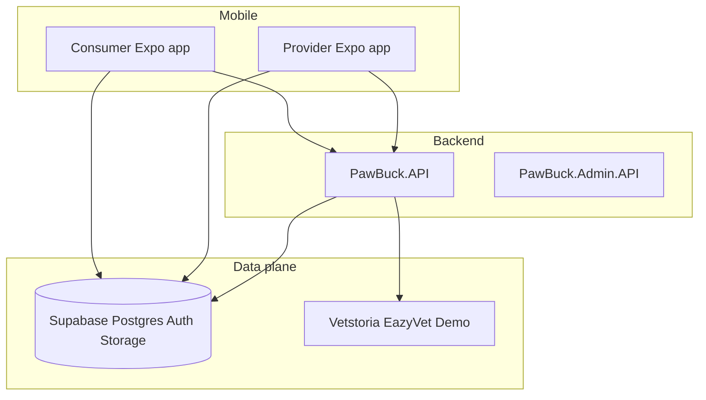

# PawBuck — system architecture

High-level boundaries for the monorepo: consumer (pet owner), future provider (service professionals), APIs, and data.

## Boundaries

| Concern | Owner | Notes |
|---------|--------|--------|
| Vet / clinic scheduling | **PawBuck.API only** | Mobile apps never call Vetstoria/EazyVet directly. See [backend/PawBuck.API/Scheduling/README.md](../backend/PawBuck.API/Scheduling/README.md). |
| Clinic routing | **Postgres** `clinic_scheduling_config` + appsettings fallback | See [docs/SUPABASE.md](SUPABASE.md). |
| Pet health records, messages, walks | **Supabase** (RLS) | Consumer app primary writer/reader today. |
| Milo / RAG / classification | **PawBuck.API** + Edge Functions | Gemini + optional Supabase `match_documentation`. |

## Marketplace (Rover-style) domain

Tables (see migration `*_marketplace_provider_domain.sql`):

- **`provider_profiles`** — one row per service-provider user (`user_id` → `auth.users`).
- **`service_offerings`** — what they sell (walk, groom, etc.).
- **`service_areas`** — country / region / optional geo radius for local markets.
- **`marketplace_service_bookings`** — links **pet owner** ↔ **provider** (separate from **`vet_bookings`**, which is clinic scheduling).

RLS allows:

- Providers to manage their profile, offerings, and areas.
- Any authenticated user to **read active** offerings (discovery); owners manage bookings they created; providers update rows for their profile.

**Auth roles:** Optional future `app_metadata.role` / JWT claims can gate the provider app UI; data access is enforced by RLS on `user_id` and profile ownership.

## Supabase source of truth

Canonical migrations: **[`supabase/`](../supabase/)** at repo root. Do not add schema under `apps/consumer-app/supabase/migrations`. Details: [docs/SUPABASE.md](SUPABASE.md).

## Shared packages

| Package | Use |
|---------|-----|
| [`@pawbuck/milo`](../packages/milo-core) | Schemas / extraction |
| [`@pawbuck/api-client`](../packages/pawbuck-api-client) | PawBuck.API HTTP helpers (e.g. booking) |

## Compliance overview

Store and privacy engineering checklist: [docs/COMPLIANCE-BACKLOG.md](COMPLIANCE-BACKLOG.md).
