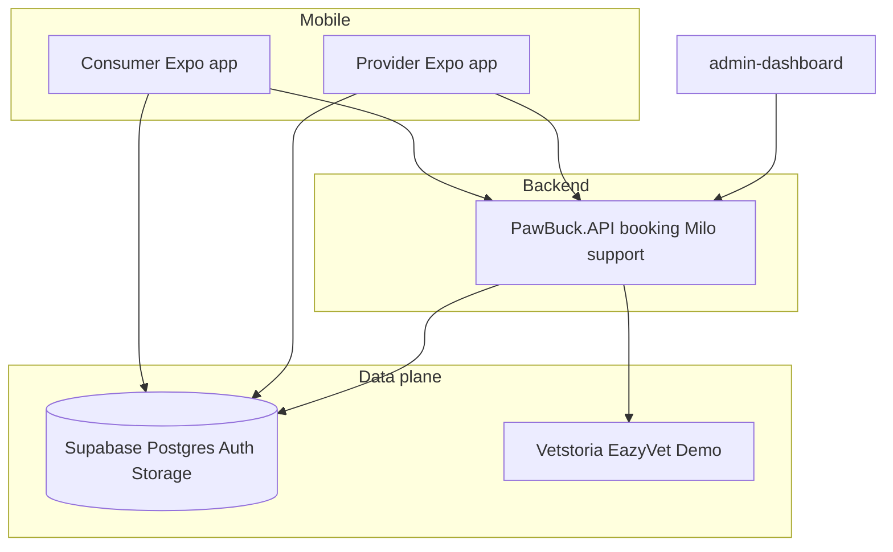

# PawBuck — system architecture

High-level boundaries for the monorepo: consumer (pet owner), future provider (service professionals), APIs, and data.

## Boundaries

| Concern | Owner | Notes |
|---------|--------|--------|
| Vet / clinic scheduling | **PawBuck.API only** | Mobile apps never call Vetstoria/EazyVet directly. See [backend/PawBuck.API/Scheduling/README.md](../backend/PawBuck.API/Scheduling/README.md). |
| Clinic routing | **Postgres** `clinic_scheduling_config` + appsettings fallback | See [docs/SUPABASE.md](SUPABASE.md). |
| Pet health records, messages, walks | **Supabase** (RLS) | Consumer app primary writer/reader today. |
| Milo / RAG / classification | **PawBuck.API** | Chat, RAG, vision, curated snippets; legacy Edge Milo retired — see [`MILO_EDGE_DEPRECATION.md`](MILO_EDGE_DEPRECATION.md) |

## Milo runtime (chat vs FAQ RAG)

**In-app conversational Milo** (Expo consumer) calls **`POST /api/milo/chat`** on **PawBuck.API** with the user’s **Supabase access token** (`Authorization: Bearer …`) — see [`apps/consumer-app/context/chatContext.tsx`](../apps/consumer-app/context/chatContext.tsx). The API runs a **plan → fetch authorized pet rows (Npgsql) → optional FAQ RAG (`documentation`) → optional curated snippets → answer** pipeline ([`MiloReasoningService`](../backend/PawBuck.API/Services/MiloReasoningService.cs)); pet scope is enforced server-side (`pets` ownership + `user_id`/`pet_id` on health tables).

Legacy Supabase Edge **`milo-chat`** and **`add-faq`** are **retired** (disabled in `supabase/config.toml`). See [`MILO_EDGE_DEPRECATION.md`](MILO_EDGE_DEPRECATION.md).

**HTTP FAQ-only Milo** ([`POST /api/milo/ask`](../backend/PawBuck.API/Controllers/MiloController.cs)) uses **PawBuck.API** [`MiloRagService`](../backend/PawBuck.API/Services/MiloRagService.cs) over the **`documentation`** table and **`match_documentation`** RPC (768-dim embeddings). No JWT required today; suitable for partners, admin, or FAQ-only clients.

### Knowledge stores

| Store | RPC / access | Embedding | Used by |
|-------|----------------|-----------|---------|
| **`documentation`** | `match_documentation` | 768-dim (Gemini `gemini-embedding-2`, .NET) | **PawBuck.API** Milo RAG (`/api/milo/ask`, `/api/milo/chat`) |
| **`milo_curated_snippets`** | SQL filter (breed / species / topic) | none (curated rows) | **`GET /api/milo/curated-guidance`**, **`POST /api/milo/chat`** |
| **`faq_documents`** | `match_documents` | 1536-dim (legacy) | **Retired** — see [`MILO_EDGE_DEPRECATION.md`](MILO_EDGE_DEPRECATION.md) |

**How to add a capability**

- **User/pet row from Postgres only** → extend [`IMiloPetFactsService`](../backend/PawBuck.API/Services/IMiloPetFactsService.cs) + plan `dataNeeded` enum in [`MiloPetFactsKinds`](../backend/PawBuck.API/Models/MiloPetFactsKinds.cs) (keep Gemini schema enums in sync).
- **New FAQ / product help for Milo** → edit [`docs/pawbuck-product-help/`](../docs/pawbuck-product-help/) + run [`seed-documentation-rag.ts`](../apps/consumer-app/scripts/seed-documentation-rag.ts).
- **Breed-/species-grounded facts** (`weight_range`, etc.) → **`milo_curated_snippets`** migration seeds + API chat heuristic.

**Principle:** **PawBuck.API** owns **chat orchestration**, **RAG**, and **authorized health reads**; do not reintroduce Milo chat on Edge.

Further detail: [docs/MILO_RAG.md](MILO_RAG.md). Edge retirement: [docs/MILO_EDGE_DEPRECATION.md](MILO_EDGE_DEPRECATION.md). Roadmap: [docs/plans/milo-domain-ai-platform.md](plans/milo-domain-ai-platform.md). Compliance: [docs/COMPLIANCE-BACKLOG.md](COMPLIANCE-BACKLOG.md).

## Marketplace (Rover-style) domain

Tables (see migration `*_marketplace_provider_domain.sql`):

- **`provider_profiles`** — one row per service-provider user (`user_id` → `auth.users`).
- **`service_offerings`** — what they sell (walk, groom, etc.).
- **`service_areas`** — country / region / optional geo radius for local markets.
- **`marketplace_service_bookings`** — links **pet owner** ↔ **provider** (separate from **`vet_bookings`**, which is clinic scheduling).

RLS allows:

- Providers to manage their profile, offerings, and areas.
- Any authenticated user to **read active** offerings (discovery); owners manage bookings they created; providers update rows for their profile.

**Auth roles:** Optional future `app_metadata.role` / JWT claims can gate the provider app UI; data access is enforced by RLS on `user_id` and profile ownership.

## Supabase source of truth

Canonical migrations: **[`supabase/`](../supabase/)** at repo root. Do not add schema under `apps/consumer-app/supabase/migrations`. Details: [docs/SUPABASE.md](SUPABASE.md).

## Shared packages

| Package | Use |
|---------|-----|
| [`@pawbuck/milo`](../packages/milo-core) | Schemas / extraction |
| [`@pawbuck/api-client`](../packages/pawbuck-api-client) | PawBuck.API HTTP helpers (e.g. booking) |

## Compliance overview

Store and privacy engineering checklist: [docs/COMPLIANCE-BACKLOG.md](COMPLIANCE-BACKLOG.md).
