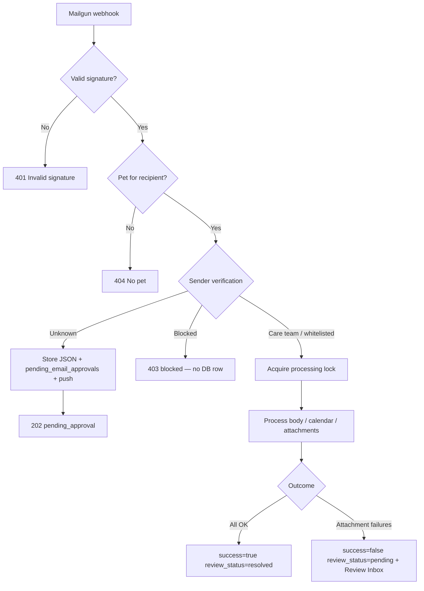

# Pet document email processing — UAT guide

This document describes **what happens when** for inbound pet health emails (Mailgun → Supabase Edge → PawBuck.API → consumer app / admin). Use it for structured UAT without guessing.

**Canonical code paths**

| Layer | Location |
|-------|----------|
| Edge (inbound + reprocess) | `supabase/functions/mailgun-process-pet-mail/` |
| Attachment pipeline | `supabase/functions/_shared/email-health-ingestion/processHealthAttachments.ts` |
| Consumer Review Inbox | `apps/consumer-app/services/failedEmails.ts`, `components/messages/ReviewInboxResolutionModal.tsx` |
| Consumer sender approval | `apps/consumer-app/services/pendingEmailApprovals.ts` |
| Resolve API | `backend/PawBuck.API/Controllers/MailController.cs` → `MailInboxResolveService.cs` |
| Admin ops | `admin-dashboard/src/components/ProcessedEmailsPanel.tsx` → `SupportProcessedEmailsService.cs` |

Legacy duplicate under `apps/consumer-app/supabase/functions/` is **not** deployed; use repo-root `supabase/functions/`.

---

## 1. Concepts & vocabulary

### Two separate “inboxes” in Messages

| UI section | DB table | Meaning |
|------------|----------|---------|
| **Pending sender approvals** | `pending_email_approvals` | Email from an **unknown** sender; user must approve/reject before processing |
| **Processing errors (N)** | `processed_emails` | Email was **accepted and processed**, but attachment filing failed or needs manual sort |

These are different flows. UAT must test both.

### Pet email address

Inbound mail is routed to `{email_id}@pets.pawbuck.com` (or your configured domain). The edge function looks up the pet by that recipient address.

### Idempotency key

`processed_emails.s3_key` = Mailgun **`Message-Id`** header (unique per email). All lock and reprocess logic uses this key.

### Stored email JSON

When processing fails (or sender is unknown), attachment bytes are archived in Supabase Storage:

- **Bucket:** `pending-emails`
- **Path:** `{sanitizedMessageId}.json`

Reprocess and attachment preview **require** this file (with attachment bodies, unless metadata-only archive).

---

## 2. Data model quick reference

### `processed_emails`

| Column | Values / meaning |
|--------|------------------|
| `status` | `processing` (lock held) → `completed` |
| `success` | `true` = pipeline OK; `false` = failed; `null` while re-opened for reprocess |
| `review_status` | `pending` (needs attention) \| `resolved` (done) \| `dismissed` (user removed from queue) |
| `failure_reason` | Human-readable failure text; non-empty often means Review Inbox |
| `document_type` | Detected type (may be wrong — user overrides on resolve) |
| `s3_key` | Message-Id; also `fileKey` for reprocess |
| `pet_id` | Pet matched by recipient email (may change on resolve if user picks another pet) |

### `pending_email_approvals`

| Column | Meaning |
|--------|---------|
| `status` | `pending` → `approved` \| `rejected` |
| `s3_bucket` | `pending-emails` |
| `s3_key` | Storage path to archived JSON |
| `sender_email` | From address |

### `pet_email_list` (safe senders)

| `is_blocked` | Meaning |
|--------------|---------|
| `false` | Whitelisted — process without approval |
| `true` | Blocked — webhook returns 403, no row created |

### `pet_care_team_members`

Vet/care-team sender emails **auto-pass** sender verification (no approval row).

---

## 3. Environment prerequisites (verify before UAT)

### Edge function `mailgun-process-pet-mail`

| Secret | Required for |
|--------|----------------|
| `MAILGUN_SECRET` | Webhook HMAC verification |
| `MAILGUN_API_KEY` | Fetch attachments from Mailgun URLs |
| `SUPABASE_URL`, `SUPABASE_SERVICE_ROLE_KEY` | DB + storage |
| `GOOGLE_GEMINI_API_KEY` | Classification + pet validation |
| `PAWBUCK_API_URL` | Vault pipeline → `POST /api/milo/documents/analyze-internal` |
| `MILO_INTERNAL_SERVICE_KEY` | Header `X-Pawbuck-Milo-Internal-Key` for analyze-internal |

**Pipeline flags** (`supabase/functions/_shared/email-health-ingestion/flags.ts`):

- Vault pipeline: **on by default** (`EMAIL_HEALTH_VAULT_PIPELINE` unset or not `false`)
- Legacy OCR: only if `EMAIL_LEGACY_OCR_PIPELINE=true` and OCR edge functions enabled

### PawBuck.API (ECS)

| Config | Required for |
|--------|----------------|
| `Supabase:ConnectionString` | Resolve, mark resolved |
| `Supabase:Url` + `Supabase:ServiceRoleKey` | Invoke edge; admin attachment preview |
| `Milo:InternalServiceKey` (`Milo__InternalServiceKey` on ECS) | **Must match** Edge `MILO_INTERNAL_SERVICE_KEY` — `POST /api/milo/documents/analyze-internal` (email vault filing) |

### Consumer app

| Env | Required for |
|-----|----------------|
| `EXPO_PUBLIC_PAWBUCK_API_URL` | `POST /api/mail/resolve` |

---

## 4. Flow A — First-time inbound (Mailgun webhook)

**Entry:** `POST {SUPABASE_URL}/functions/v1/mailgun-process-pet-mail` (multipart, Mailgun route)



### Step-by-step

1. **Verify Mailgun signature** — invalid → `401`, no side effects.
2. **Parse email** — must have `Message-Id`, recipient, sender.
3. **Lookup pet** by recipient address — not found → `404`.
4. **Sender verification** (`handlers/senderVerification.ts`):

   | Sender status | Result | DB |
   |---------------|--------|-----|
   | Care team member | Proceed | — |
   | Whitelisted (`pet_email_list`, `is_blocked=false`) | Proceed | — |
   | Blocked | `403` `{ status: "blocked" }` | **No** `processed_emails` row |
   | Unknown | Store JSON, create `pending_email_approvals`, push notification | **No** lock yet; `202 pending_approval` |

5. **Acquire lock** (`tryAcquireProcessingLock` on `Message-Id`):

   | Existing row | Result |
   |--------------|--------|
   | None | Insert `status=processing`, continue |
   | `completed` | `200` “Email already processed” — skip |
   | `processing` (< 15 min) | `200` “Email is currently being processed” — skip |
   | `processing` (stale > 15 min) | Reclaim lock, continue |
   | DB error | `503 processing_lock_unavailable` |

6. **Optional:** store text body in message thread; import `.ics` calendar attachments.
7. **Process health attachments** (PDF/images, non-calendar):
   - Classify (Gemini) → `vaccinations` \| `medications` \| `lab_results` \| `clinical_exams` \| `irrelevant` \| others
   - Validate pet on document (name/breed/microchip)
   - **Vault path (default):** upload → PawBuck.API analyze-internal → `vaultPersisted`
   - **Legacy OCR path (if enabled):** OCR edge function → DB tables
8. **Finalize** (`markEmailAsCompleted`):

   | Scenario | `success` | `review_status` | `failure_reason` | Store JSON? | Push notification |
   |----------|-----------|-----------------|------------------|-------------|-------------------|
   | No attachments | `true` | `resolved` | cleared | No | None |
   | Calendar-only (no health PDFs) | `true` | `resolved` | cleared | No | Calendar pending if imports |
   | ≥1 relevant attachment saved | `true` | `resolved` | cleared | No | `email_processed` |
   | All="non-irrelevant" attachments, **zero** saves | `false` | `pending` | Detailed per-file reasons | Yes (first failure only) | `email_attachment_failed` |
   | Uncaught exception after lock | `false` | `pending` | Exception message | Yes (if not reprocess) | `email_failed` |

**Success rule** (`computeEmailSuccess` in `pipelineOutcome.ts`):

- Fails if calendar attempted with error, or attachments have **hard failures** (validation mismatch, OCR/DB failure).
- **Hard failure skip reasons:** `no_pet_info`, `attributes_mismatch`, `microchip_mismatch`.

---

## 5. Flow B — Unknown sender approval

**Entry:** Messages → pending approval card → **Approve** or **Reject**

### Approve

1. `pending_email_approvals.status = 'approved'`
2. Add sender to `pet_email_list` (`is_blocked=false`)
3. Invoke edge JSON: `{ bucket: "pending-emails", fileKey: s3_key }` (reprocess mode, no doc override)
4. Edge skips sender verification; runs normal attachment pipeline
5. On success, stored JSON is deleted

**Expected:** health records filed; no pending approval row in UI; push may include `email_processed`.

**Failure:** approval stays `approved` but processing may fail → item may appear under **Processing errors** instead.

### Reject

1. `pending_email_approvals.status = 'rejected'`
2. Add sender to blocklist (`is_blocked=true`)
3. No reprocessing

**Push (new unknown sender only):** title **“New Email Requires Approval”**, `data.type = email_approval`.

---

## 6. Flow C — Review Inbox (Processing errors)

### When a row appears in the consumer inbox

Query: `getReviewInbox()` in `failedEmails.ts`

**SQL filters:**

- `status = 'completed'`
- `success = false` OR `failure_reason IS NOT NULL`
- Pet belongs to current user

**Client filter** (`isReviewInboxCandidate`):

- **Exclude** if `review_status` is `dismissed` or `resolved`
- **Include** if `success = false` OR non-empty `failure_reason`

**Legacy edge case:** `success = true` but `failure_reason` still set and `review_status = pending` → **still shown** (allows resolve).

### User actions

#### View / preview attachment

- Calls edge `get-failed-email-attachment` with `s3_key` (Message-Id).
- **If JSON missing or metadata-only (bodies stripped):** preview unavailable; codes `ATTACHMENT_NOT_STORED`, `ATTACHMENT_BODY_NOT_ARCHIVED`.

#### Dismiss

- Updates: `review_status = 'dismissed'`, `success = false`
- **Does not** delete health records or reprocess
- Item disappears from **Processing errors**

#### Confirm (Review & sort modal)

1. User picks **pet** + **document type**: Vaccine \| Medication \| Lab \| Clinical visit
2. App calls `POST /api/mail/resolve` with Supabase JWT

**API validations** (`MailInboxResolveService`):

| Condition | HTTP | User message |
|-----------|------|--------------|
| Missing fields | 400 | (validation) |
| Pet not owned | 403 | Pet not found or not owned |
| Row not found | 404 | email record not found |
| Already dismissed | 409 | This item was already dismissed… |
| Already fully resolved (`success=true`, no failure_reason) | 409 | already marked successfully processed |
| Edge HTTP failure | 502 | Document reprocessing failed. Please try again later. |
| Edge skip (already processed / in progress) | 409 | Email already processed / Email is currently being processed |
| Edge OK but no records inserted | 422 | We couldn't save a health record from this email… |
| Success | 200 | Alert: **Record filed!** {pet}'s {docLabel} has been updated. |

3. Edge reprocess: `{ fileKey: s3_key, overridePetId, documentTypeOverride }`
4. Edge re-opens completed review row → processes **first attachment only** with forced doc type
5. API marks: `review_status=resolved`, `failure_reason=NULL`, `success=TRUE`, `pet_id=selected`

**Modal error title:** **Could not file record** + API error body.

---

## 7. Flow D — Admin support (Processed Emails panel)

**Auth:** support JWT with admin role (`/api/support/processed-emails/*`)

### List / filter

Filter by date range, `document_type`, `review_status`, search on `failure_reason` + `subject`.

### Bulk **clear** (dismiss or resolve) — **does NOT reprocess**

| Action | DB update | Health records |
|--------|-----------|----------------|
| **Dismiss** | `review_status=dismissed`, `success=false` | Unchanged |
| **Resolve** | `review_status=resolved`, `failure_reason=NULL`, `success=true` | **Not created** — inbox state only |

Max **500** rows per batch. Same visibility filter as consumer Review Inbox (excludes already dismissed/resolved).

### Bulk **reprocess** — files records

1. Select candidates (same failure rules; can include dismissed if `includeDismissed=true`)
2. Map `document_type` or admin default doc type
3. Invoke same edge reprocess as consumer
4. On insert success: mark `review_status=resolved`

Max **10** rows per batch (configurable up to 50).

**Requires:** stored JSON in `pending-emails` + edge secrets (`PAWBUCK_API_URL`, `MILO_INTERNAL_SERVICE_KEY`).

### Per-row **Reprocess & file**

Same as bulk reprocess for one row.

---

## 8. Document types & pipelines

| User / API label | Pipeline key | Typical DB / vault target |
|------------------|--------------|---------------------------|
| Vaccine | `vaccinations` | `vaccinations` or vault doc |
| Medication | `medications` | `medicines` or vault doc |
| Lab | `lab_results` | `lab_results` or vault doc |
| Clinical visit | `clinical_exams` | `clinical_exams` or vault doc |

**Auto classification:** Gemini picks type per attachment unless reprocess forces type.

**Review Inbox reprocess:** forces user-selected type on **attachment index 0 only**.

**Pet validation failures** (common UAT failures):

- Breed/name mismatch on PDF vs pet profile
- Missing pet info on document
- Microchip mismatch (may notify but still fail hard insert depending on path)

---

## 9. Notifications reference

| `data.type` | When |
|-------------|------|
| `email_approval` | New unknown sender |
| `email_processed` | ≥1 health record saved on happy path |
| `email_attachment_failed` | All relevant attachments failed |
| `email_failed` | Exception after lock acquired |
| `email_microchip_mismatch` | Mismatch detected (informational) |
| Calendar | ICS imports pending review |

---

## 10. DB state matrix (expected after each outcome)

| Outcome | `status` | `success` | `review_status` | `failure_reason` | Consumer UI |
|---------|----------|-----------|-----------------|------------------|-------------|
| In flight | `processing` | null | null | null | Not in Processing errors |
| Auto-filed OK | `completed` | `true` | `resolved` | NULL | Hidden |
| Needs review | `completed` | `false` | `pending` | set | **Processing errors** |
| Legacy flagged | `completed` | `true` | `pending` | set | **Processing errors** |
| User dismissed | `completed` | `false` | `dismissed` | may remain | Hidden |
| User/admin resolved (with reprocess) | `completed` | `true` | `resolved` | NULL | Hidden |
| Admin resolve-only (no reprocess) | `completed` | `true` | `resolved` | NULL | Hidden — **no new records** |
| Unknown sender (pre-lock) | — | — | — | — | Pending approvals |
| Blocked sender | — | — | — | — | Nothing |
| Stuck lock (bug / retry) | `processing` | null | `pending` | null | Confirm may fail until fixed/deployed |

---

## 11. UAT test matrix

Use **staging** with test pet, whitelisted vet sender, and known bad PDFs.

### Inbound & sender gate

| ID | Given | When | Then |
|----|-------|------|------|
| IN-01 | Pet exists; sender whitelisted; valid vaccination PDF matching pet | Vet emails PDF to pet address | `processed_emails`: success=true, review_status=resolved; record in health/vault; push `email_processed`; **no** Processing errors |
| IN-02 | Unknown sender; email has PDF | Webhook fires | `pending_email_approvals.status=pending`; JSON in `pending-emails`; push `email_approval`; **no** `processed_emails` yet |
| IN-03 | IN-02 pending approval | User taps Approve | Sender whitelisted; email processed; records filed; approval approved |
| IN-04 | Unknown sender | User taps Reject | approval rejected; sender blocked; future mail from sender → 403 |
| IN-05 | Sender blocked in safe senders | Webhook fires | 403; no processed_emails row |
| IN-06 | Invalid Mailgun signature | Webhook fires | 401; no DB changes |
| IN-07 | Recipient not mapped to any pet | Webhook fires | 404 |
| IN-08 | Same Message-Id delivered twice within seconds | Second webhook | 200 “Email already processed”; no duplicate records |
| IN-09 | Email with no attachments (body only) | Webhook | success=true, resolved; no Review Inbox |
| IN-10 | Care team vet email linked to pet | Inbound from vet | No approval step; processes immediately |

### Attachment failures → Review Inbox

| ID | Given | When | Then |
|----|-------|------|------|
| RI-01 | Whitelisted sender; PDF breed/name does not match pet | Webhook | success=false, review_status=pending, failure_reason populated; JSON stored; **Processing errors (1)** |
| RI-02 | RI-01 row in inbox | User opens item | Failure summary visible; attachment preview works if JSON has bodies |
| RI-03 | RI-01; user fixes pet profile OR picks correct pet on confirm | Confirm as Vaccine | 200; review_status=resolved; vaccine record exists; “Record filed!” |
| RI-04 | RI-01 row | User dismisses | review_status=dismissed; leaves inbox; records unchanged |
| RI-05 | Row dismissed | User opens Messages | Item **not** in Processing errors |
| RI-06 | Metadata-only JSON (large email stripped bodies) | Preview attachment | Unavailable / ATTACHMENT_BODY_NOT_ARCHIVED |
| RI-07 | JSON deleted from `pending-emails` | Confirm | 422 or edge failure; row stays pending |

### Resolve API / reprocess

| ID | Given | When | Then |
|----|-------|------|------|
| RP-01 | Valid Review Inbox row + stored JSON + secrets configured | Confirm Lab | Record filed; resolved |
| RP-02 | Edge missing `PAWBUCK_API_URL` | Confirm | 422 or pipeline failure; stays pending |
| RP-03 | Row already resolved | Confirm | 409 already marked successfully processed |
| RP-04 | Row dismissed | Confirm | 409 already dismissed |
| RP-05 | Double-tap Confirm while first run in progress | Second request | 409 “currently being processed” (expected) |
| RP-06 | Wrong pet selected (not owner) | API call | 403 |

### Admin

| ID | Given | When | Then |
|----|-------|------|------|
| AD-01 | Multiple pending failures in date range | Bulk dismiss (dry run → execute) | Rows dismissed; consumer inbox count drops |
| AD-02 | Failures with stored JSON | Bulk reprocess (10 batch) | Records filed; rows resolved |
| AD-03 | Failures | Bulk resolve **without** reprocess | review_status=resolved but **no** new health records |
| AD-04 | Dismissed row | Bulk reprocess with includeDismissed | Can reprocess (admin only) |

### End-to-end regression (production smoke)

| ID | Step | Pass criteria |
|----|------|---------------|
| E2E-01 | Send test vaccine PDF from whitelisted sender | Auto-filed within 2 min |
| E2E-02 | Send from unknown sender → approve | Files after approval |
| E2E-03 | Force validation failure → Confirm in app | “Record filed!” and record visible |
| E2E-04 | Admin preview attachment for failed row | PDF renders or clear error code |

---

## 12. Common failure messages (troubleshooting)

| User / log message | Likely cause | Fix |
|--------------------|--------------|-----|
| Email is currently being processed | Lock race or row stuck in `processing` | Deploy API+edge lock fix; or reset row `status=completed` for pending review rows |
| Email already processed | Duplicate webhook or row already completed | Expected for retries; check if records exist |
| Document reprocessing failed (502) | Edge unreachable or 5xx | Check Supabase function logs; service role key on API |
| We couldn't save a health record (422) | Milo/analyze failed; validation; empty extraction | Check edge secrets; pet profile; PDF quality |
| Attachment Unavailable | No JSON or metadata-only archive | Re-send email or manual upload |
| ATTACHMENT_NOT_STORED | `pending-emails` file missing | Cannot reprocess; need original email re-sent |

### SQL: unstick rows left in `processing` (support only)

```sql
UPDATE processed_emails
SET status = 'completed'
WHERE status = 'processing'
  AND COALESCE(review_status, 'pending') = 'pending'
  AND (success IS NULL OR success = false OR failure_reason IS NOT NULL);
```

Run only when no active worker is processing those rows.

---

## 13. Admin portal (Mail errors) — use this instead of SQL

Default **View: Consumer Review Inbox** matches Messages → **Processing errors** (includes legacy `success=true` + `failure_reason` and stuck `status=processing`).

Select a row → **Diagnostics (no SQL)**:

| Field | Meaning |
|-------|---------|
| Consumer Processing errors | visible / hidden + reason |
| Owner Confirm allowed | Same as `POST /api/mail/resolve` eligibility |
| pending-emails archive | `stored` \| `missing` \| `metadata_only` \| `storage_not_configured` |
| Recommended | Next support action |

Use **Owner email filter**, **90d** preset, and subject search before writing SQL.

---

## 14. Deploy checklist (email path)

1. **Push** latest `main` (includes lock-race fix in API + edge).
2. **Deploy PawBuck.API** (GitHub Actions → Deploy AWS → api).
3. **Deploy edge:** `supabase functions deploy mailgun-process-pet-mail --project-ref <ref>`
4. **Verify secrets** on edge + ECS (section 3).
5. Run **E2E-01 through E2E-04** on staging, then production.

---

## 14. Related docs

- [`docs/AWS.md`](AWS.md) — ECS env vars including `Supabase__ServiceRoleKey`
- [`docs/ARCHITECTURE.md`](ARCHITECTURE.md) — integration boundaries
- [`supabase/functions/mailgun-process-pet-mail/README.md`](../supabase/functions/mailgun-process-pet-mail/README.md) — edge developer reference
