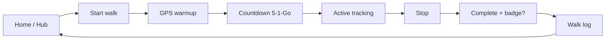
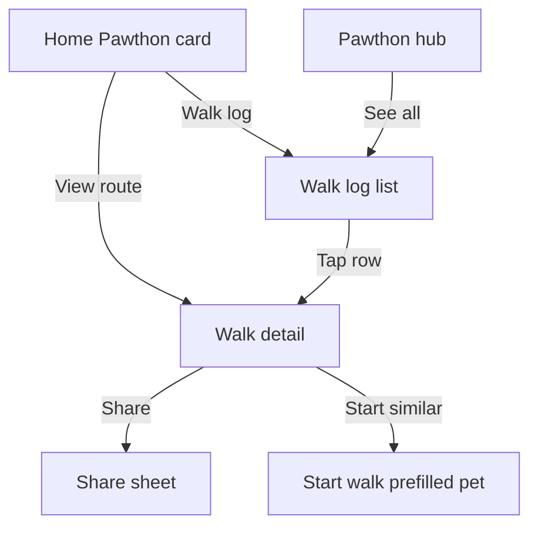
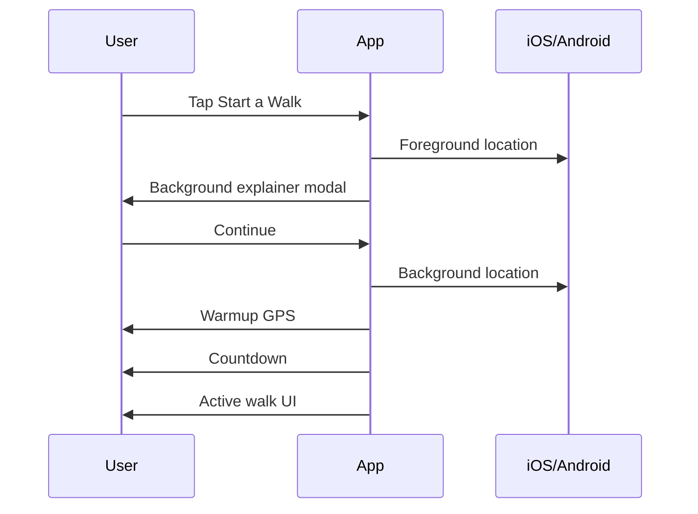
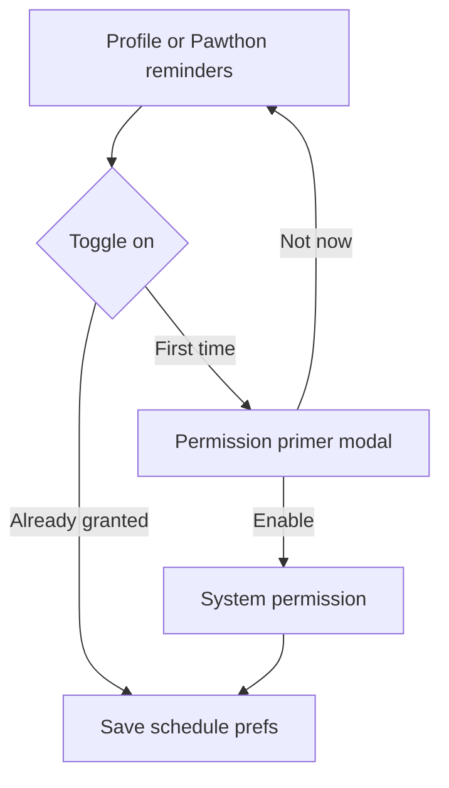
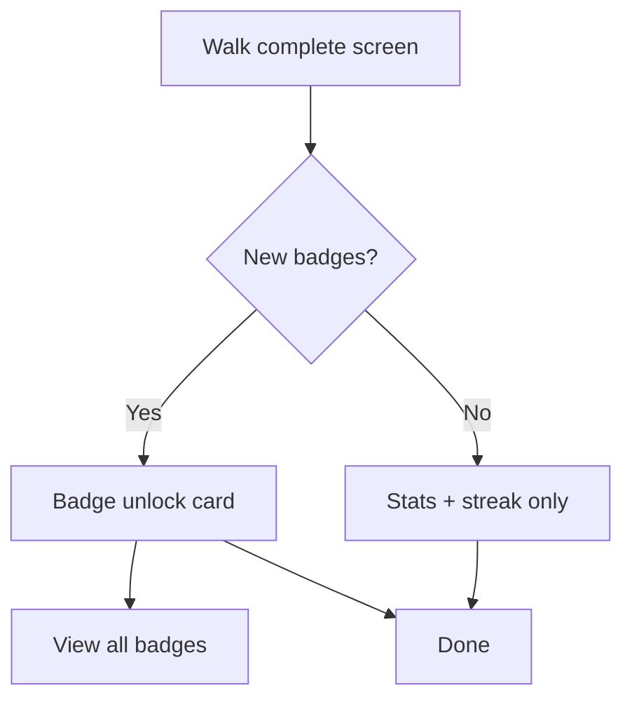
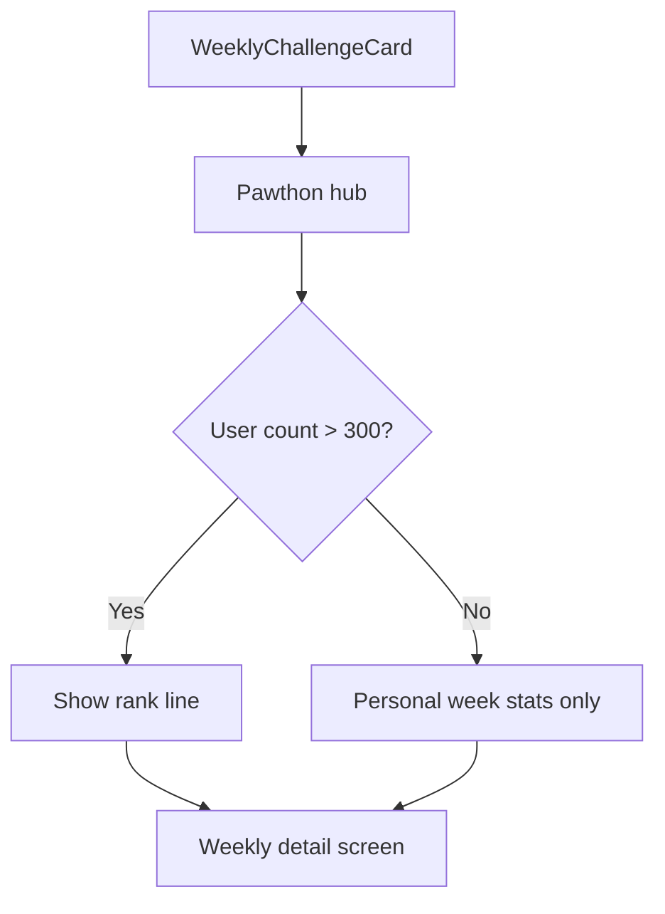

# Pawthon engagement — user flows

Design-phase flows only. Implementation follows [`PAWTHON_ENGAGEMENT_UI_SPEC.md`](../PAWTHON_ENGAGEMENT_UI_SPEC.md).

---

## Primary habit loop

---

## Discovery: past walks

---

## First-time walker

---

## Notifications opt-in

---

## Badge unlock (post-walk)

---

## Weekly challenge (data gating)

---

## Screen inventory (14 frames in preview)

| # | Screen | Phase |
|---|--------|-------|
| 1 | Home — Pawthon card | 1–2 |
| 2 | Pawthon hub | 1–2–6 |
| 3 | Walk log | 1 |
| 4 | Walk detail | 1 |
| 5 | Start walk — select pet | existing |
| 6 | GPS warmup | existing |
| 7 | Countdown overlay | 3 |
| 8 | Active walk | existing |
| 9 | Walk complete | 4 |
| 10 | Badge unlock | 4 |
| 11 | Badges grid | 4 |
| 12 | Reminders settings | 5 |
| 13 | Notification primer | 5 |
| 14 | Weekly detail | 6 |
