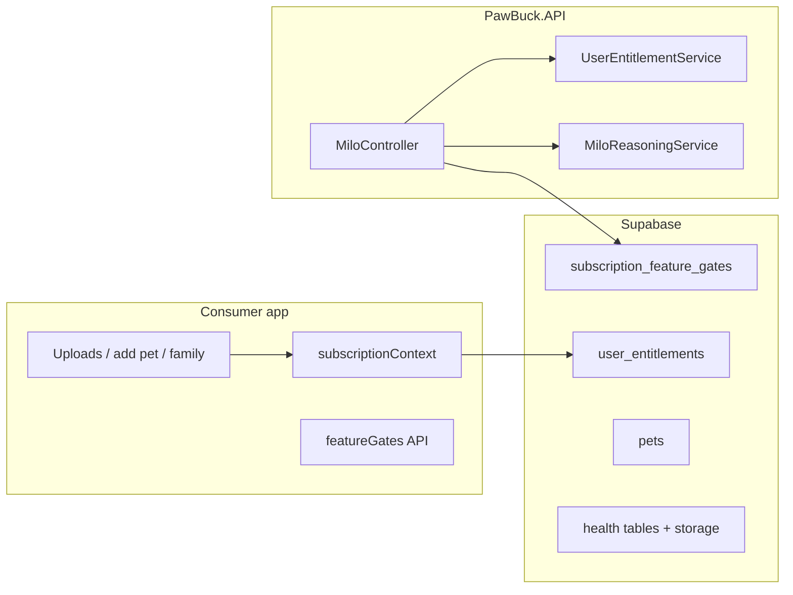

# Free vs Pawbuck Pro — implementation plan (saved)

**Status:** Superseded by [`docs/PRICING.md`](../PRICING.md) (v1.5 tiers: Free / Individual / Family). Kept for historical context only.

This file mirrors the Cursor plan **Free vs Pro enforcement** for version control. Todos are checklists only (not synced to Cursor).

## Todos (when you pick this up)

- [ ] Lock product rules: 5-doc definition, single-pet vs transfer, free journal scope
- [ ] Expand docs/SUBSCRIPTION.md + gate/limit mapping
- [ ] Postgres trigger/RPC: block 2nd pet for non-premium + client guards
- [ ] MiloController + MiloReasoningService: Limited vs Full tier + xUnit tests
- [ ] Define count + RPC/RLS + upload modal checks for 5-doc cap
- [ ] DB + family-access UI: max 5 members per product spec
- [ ] Re-enable subscription_feature_gates + paywall/store copy

---

## Overview

Implement the Free vs Pawbuck Pro matrix with **server-truth** limits (pets, documents, care-team size), **tiered Milo** (FAQ-only vs clinical + pet facts), and **client paywalls** aligned with existing `user_entitlements`, RevenueCat, and `subscription_feature_gates`.

## Current baseline (repo)

- **Premium flag:** `apps/consumer-app/context/subscriptionContext.tsx` (`isPremium` from `user_entitlements` + RevenueCat + dev override).
- **Feature gates:** `apps/consumer-app/constants/featureGates.ts` + `public.subscription_feature_gates` (migrations `20260328140000_subscription_feature_gates.sql`, `20260507120000_subscription_gates_family_pet_transfer.sql`).
- **Milo today:** `backend/PawBuck.API/Controllers/MiloController.cs` returns **402** for non-premium when `RequirePremiumForMilo` **or** DB gate `milo_chat` requires premium — **no** “limited free Milo” path yet; `MiloReasoningService` already separates product/RAG vs clinical scribe prompts but does not take a **tier** flag from the controller.
- **Pet creation:** `apps/consumer-app/services/pets.ts` inserts into `pets` — **no** second-pet limit.
- **Uploads:** many entry points (e.g. vaccination/exam upload modals, medicines, labs) — **no** shared “document quota” today.
- **Care team:** `apps/consumer-app/services/careTeamMembers.ts` — **no** cap at 5.
- **Docs:** `docs/SUBSCRIPTION.md` matrix is shorter than the full product spec.

## Product clarifications (blockers to lock before coding)

1. **“5 documents”:** Per **pet** or per **account**? Count only **manual** uploads (health modals), or include **email-ingested** attachments? Which tables count as one “document” (vaccination + exam + lab + medicine each with `document_url`, etc.)?
2. **“Single pet”:** Block **second pet row** for free only, or also block **incoming transfer** as second pet (transfer may already be Pro-only via `transfer-pet`)?
3. **Free “Basic journaling”** vs **Pro journal / briefing:** Today journal/briefing are premium-gated in UI; confirm free tier still **excludes** full journal or you want a **reduced** free journal surface.

## Implementation phases

### Phase A — Spec and config surface

- Extend `docs/SUBSCRIPTION.md` with the full matrix and map each row to **gate key**, **API/RLS owner**, and **client entry points**.
- Add **numeric limits** in one place (avoid magic numbers scattered):
  - Option 1: New `public.subscription_limits` table or JSON in app config (migration + small API to read).
  - Option 2: **Constants in API + shared doc** for v1, migrate to DB later.
- Align `SubscriptionFeatureKeys` / `FEATURE_GATE_KEYS` if you introduce new gates (e.g. `milo_clinical`, `health_document_upload`, `multi_pet`) — or reuse `milo_chat` with **tiered behavior** instead of a second key.

### Phase B — Multi-pet limit (free = 1 pet)

- **Server (required):** Postgres **BEFORE INSERT** on `public.pets` (or `SECURITY DEFINER` RPC used by insert) that counts active pets for `NEW.user_id` and reads premium from `user_entitlements`. Reject with clear error.
- **Client:** `AddPetCard`, `HomeHeader`, `home.tsx` “Add pet”, `onboarding/review`: if `pets.length >= 1` and `!isPremium`, `ensurePremium` / paywall **before** navigation or `addPet`.
- **Tests:** migration or integration test for insert denial; optional Jest for client guard if extracted to a pure helper.

### Phase C — Milo “Limited” (free) vs “Clinical Concierge” (Pro)

- **Controller:** When user is **not** premium and gate allows chat (or new flag `AllowFreeTierMiloLimited` in `SubscriptionOptions`), **do not** return 402; pass `MiloTier: Limited | Full` into `IMiloReasoningService.ChatAsync` (extend request pipeline or overload).
- **Reasoning** (`MiloReasoningService`):
  - **Limited:** force documentation RAG; **never** fetch pet facts / never clinical-scribe prompt; optionally disable `JournalMode` server-side.
  - **Full:** current behavior (planner + facts + RAG).
- **Gates:** Either set `milo_chat` `requires_premium = false` and enforce tier in code, or split keys — product + ops preference.
- **Tests:** extend `MiloReasoningServiceChatTests` / new tests for “limited tier never loads pet rows”.

### Phase D — Free document cap (5)

- Define **canonical count query** (SQL view or RPC) once product answers Q1.
- **Server:** enforce at **write** boundary — RPC `assert_document_quota` from Edge/API that perform OCR, plus **client pre-check** for UX.
- **Client:** shared helper + `ensurePremium` when over quota in upload modals.
- **Grandfathering:** document policy in `SUBSCRIPTION.md`.

### Phase E — Care team cap (5)

- Confirm cap is **per pet** on `pet_care_team_members` vs **family grants** (`pet_family` migrations). Add **DB trigger** on insert + **client** validation in `family-access` / `careTeamMembers.ts`.
- Paywall copy when at cap.

### Phase F — Already gated features (verify only)

- Family sharing, pet transfer, journal, briefing, book vet, weekly challenge: **re-enable** `requires_premium` in DB when going live per `SUBSCRIPTION.md`.

### Phase G — Compliance / store

- In-app subscription / paywall copy and store listings; see `docs/COMPLIANCE-BACKLOG.md`.

## Suggested order of delivery

1. Phase A + B (single pet + docs).
2. Phase C (Milo tiered).
3. Phase D + E (quotas and caps).
4. Phase F + G (gates + copy).

## Risks

- **Client-only limits are bypassable**; DB/API enforcement is mandatory for pets, documents, and care-team counts.
- **Milo limited** must be **prompt + data** enforced, not UI-only, to avoid leaking pet health rows to Gemini for free users.
