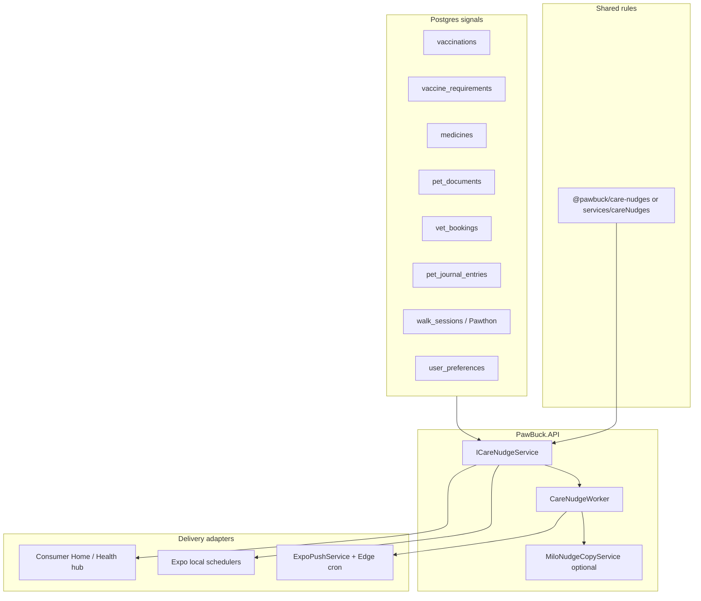
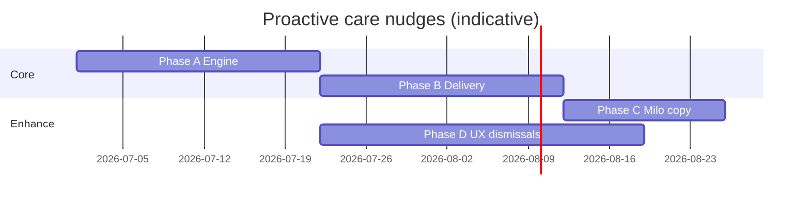

# Proactive care nudges — implementation plan

**Status:** Reviewed — decisions locked; awaiting implementation go-ahead  
**Owner:** Consumer + PawBuck.API  
**Last updated:** 2026-06-29  

**Related docs**

- [ARCHITECTURE.md](../ARCHITECTURE.md) — API vs Supabase boundaries  
- [NOTIFICATIONS_5.4_AUDIT.md](../NOTIFICATIONS_5.4_AUDIT.md) — existing reminder channels  
- [COMPLIANCE-BACKLOG.md](../COMPLIANCE-BACKLOG.md) — prefs, retention, health-adjacent copy  
- [milo-domain-ai-platform.md](./milo-domain-ai-platform.md) — Milo copy/eval gates (Phase C)  
- [TESTING.md](../TESTING.md) — test commands  

---

## Executive summary

PawBuck already nudges owners about vaccines, meds, journal, vet visits, and document expiry—but logic and delivery are **split across client utils, Edge functions, and one narrow API worker**. This plan unifies them into a **rule-driven care nudge platform**:

1. **Deterministic rules** decide *if*, *when*, and *priority* (never LLM).  
2. **Shared catalog** powers in-app Home/Health surfaces and push/local delivery.  
3. **Optional Milo** polishes copy only (bounded, eval-gated).  
4. **No autonomous agents**—every clinical nudge links to evidence rows the user can verify.

**Recommended sequencing:** Phase A (shared engine, in-app only) → Phase B (delivery + dedupe) → Phase C (Milo copy) → Phase D (UX polish). Phases A–B deliver most product value; C–D are incremental.

---

## Goals

| Goal | Measure |
|------|---------|
| Single source of truth for “what should we show/nudge?” | App Home and API worker produce identical nudge sets for same pet snapshot |
| Expand proactive coverage without spam | Dedupe + prefs + daily caps per user |
| Trustworthy clinical nudges | Every nudge cites evidence (`vaccinations.id`, `vet_bookings.id`, etc.) |
| Maintain architecture boundaries | Rules + reads in API/shared package; RLS unchanged; no vendor calls from app |
| Prepare for Milo differentiation | Optional warm copy layer with eval suite |

## Non-goals (v1)

- Autonomous agents that decide actions or write health records  
- Nudges inferred from unverified extraction (due-only vaccines, flexible-only JSON)  
- Diagnosis, dosing, or “your pet has X condition” language  
- Provider-app or marketplace nudges (consumer pet health only)  
- Replacing local notification scheduling entirely (local remains for device-offline reliability)  
- Custom ML models for nudge targeting (see milo-domain-ai-platform Phase 4 gates)

---

## Current state (baseline)

### In-app (client-only rules)

| Component | Path | Behavior |
|-----------|------|----------|
| Catch-up carousel | `apps/consumer-app/components/home/CatchUpSection.tsx` | Vaccines due within country alert window; meds due today |
| Home “Today” priority | `apps/consumer-app/utils/homeTodaySnapshot.ts` | Top catch-up item for briefing |
| Daily wellness ring | `apps/consumer-app/components/home/DailyWellnessSection.tsx` | Vaccination progress toward next due |
| Health hub attention | `apps/consumer-app/utils/healthHubAttention.ts` | Overdue count (latest admin per vaccine name) |
| Required vaccine gaps | `apps/consumer-app/services/vaccineRequirements.ts` | Missing core vaccines by country/species |
| Vaccine hub summary | `apps/consumer-app/utils/vaccineHubSummary.ts` | Hub badges and compliance copy |

### Local notifications (device)

| Type | Path | Notes |
|------|------|-------|
| Vaccines 30/7/day-of | `utils/notifications/vaccinationNotificationScheduler.ts`, `vaccineReminderDates.ts` | 9:00 local |
| Medications | `utils/notifications/medicationNotificationScheduler.ts` | Per schedule |
| Journal prompt | `utils/notifications/journalPromptNotificationScheduler.ts` | User hour/minute prefs |
| Pawthon walks | `services/pawthonWalkReminders.ts` | Streak / schedule |

### Server push

| Type | Path | Dedupe |
|------|------|--------|
| Document expiry (insurance/travel) | `supabase/functions/scheduled-care-reminders/index.ts` | `document_expiry_reminder_sent` |
| Vet T-24h / T-1h | same Edge function | `vet_booking_reminder_sent` |
| Senior mobility tip | `backend/PawBuck.API/Services/ProactivePetHealthWorker.cs` | `proactive_pet_health_sends` |

### User preferences (existing columns)

From `user_preferences` (migration `20260516140000_notifications_strategy_5_4.sql`):

- `journal_prompt_enabled`, `journal_prompt_hour`, `journal_prompt_minute`  
- `document_expiry_push_enabled`  
- `vet_appointment_reminder_push_enabled`  

Subscription gate: `health_alerts` feature (used in scheduled-care-reminders via `ownerMeetsFeatureGate`).

### Gaps today

1. **No shared nudge model** — duplicate rule logic client vs server  
2. **Catch-up / missing-required / overdue** — in-app only, no unified push policy  
3. **Three dedupe mechanisms** — not generalized  
4. **Proactive worker** — one heuristic (senior + mobility keywords), not catalog-driven  
5. **No snooze/dismiss** — users cannot defer a nudge class  
6. **No observability** — no metrics on nudge generation vs delivery vs tap-through  

---

## Target architecture



### Design principles

1. **`CareNudge` is a pure data object** — computed from inputs, no side effects.  
2. **Stable dedupe keys** — `kind + petId + logicalKey` (e.g. `vac-overdue:pet:rabies-canonical`).  
3. **Evidence required** for clinical kinds — `evidence: { table, id, field? }`.  
4. **Priority band** — `critical | high | medium | low` mapped to sort order + daily push budget.  
5. **Channel eligibility** — each kind declares allowed channels; prefs filter at delivery time.

---

## Nudge catalog (v1)

### Clinical / scheduling (high trust)

| Kind ID | Trigger rule | Evidence | In-app | Local | Push | Default priority |
|---------|--------------|----------|--------|-------|------|------------------|
| `vac_overdue` | Latest row per canonical vaccine name; `next_due_date < today` | `vaccinations.id` | ✓ | — | ✓ | critical |
| `vac_due_soon` | Due within `getVaccinationAlertPeriod(name, country)` | `vaccinations.id` | ✓ | ✓ (30/7/0) | optional | high |
| `vac_missing_required` | `computeRequiredVaccinesStatus.missing` non-empty | requirement key | ✓ | — | ✓ (weekly cap) | high |
| `med_due_today` | `getNextMedicationDose(med)` is today | `medicines.id` | ✓ | ✓ | — | medium |
| `vet_appt_24h` | Confirmed booking in window | `vet_bookings.id` | ✓ | — | ✓ | high |
| `vet_appt_1h` | Confirmed booking in window | `vet_bookings.id` | ✓ | — | ✓ | critical |
| `doc_expiry_*` | Insurance/travel expiry buckets 30/7/1/0 | `pet_documents.id` | ✓ | — | ✓ | medium |

### Wellness / engagement (lower clinical weight)

| Kind ID | Trigger rule | Evidence | In-app | Local | Push | Default priority |
|---------|--------------|----------|--------|-------|------|------------------|
| `journal_prompt` | No journal entry today (if enabled) | — | ✓ | ✓ | — | low |
| `senior_mobility_tip` | Age ≥ 8 + journal keyword match (48h) | journal blob hash | — | — | ✓ | low |
| `pawthon_streak` | Streak at risk (existing Pawthon rules) | walk metrics | ✓ | ✓ | — | low |
| `daily_wellness_progress` | Next vaccine due within window (UI ring) | `vaccinations.id` | ✓ | — | — | low |

### Explicit exclusions

- Do **not** nudge from `pet_documents` vaccination extraction until clinical sync created a `vaccinations` row with `administeredDate` proof.  
- Do **not** nudge “missing required” if the only signal is a due-only line on a certificate.  
- Do **not** push more than **N** clinical nudges per user per day (reviewer decision: **N=3**, configurable).

---

## Data model (Phase B)

### New table: `care_nudge_deliveries`

Service-role only (same pattern as `proactive_pet_health_sends`).

```sql
-- Conceptual schema (final names in migration PR)
CREATE TABLE public.care_nudge_deliveries (
  id uuid PRIMARY KEY DEFAULT gen_random_uuid(),
  user_id uuid NOT NULL REFERENCES auth.users(id) ON DELETE CASCADE,
  pet_id uuid REFERENCES public.pets(id) ON DELETE CASCADE,
  nudge_kind text NOT NULL,
  dedupe_key text NOT NULL,
  channel text NOT NULL CHECK (channel IN ('push', 'local', 'in_app')),
  sent_at timestamptz NOT NULL DEFAULT timezone('utc', now()),
  metadata jsonb NOT NULL DEFAULT '{}'::jsonb,
  UNIQUE (user_id, dedupe_key, channel)
);
```

**Migration strategy:** Keep existing dedupe tables during Phase B; backfill adapter writes to both OR migrate readers incrementally. Drop legacy tables only in a follow-up migration after 30-day soak.

### New table: `care_nudge_dismissals` (Phase D)

```sql
CREATE TABLE public.care_nudge_dismissals (
  user_id uuid NOT NULL,
  pet_id uuid NOT NULL,
  nudge_kind text NOT NULL,
  dismissed_until date,  -- NULL = permanent for this kind+pet
  created_at timestamptz NOT NULL DEFAULT timezone('utc', now()),
  PRIMARY KEY (user_id, pet_id, nudge_kind)
);
```

RLS: owner read/write own rows.

### Optional: `care_nudge_generation_log` (Phase B, ops)

Lightweight row per worker run per pet (no message text): `{ pet_id, kinds_generated[], kinds_delivered[], run_id }` for support/debug. Retention: 90 days (align with `RetentionWorker` pattern).

### Account deletion / export

Extend `erase_user_data` RPC and export bundle to include new tables (same pattern as `proactive_pet_health_sends` in `20260615130000_retention_and_data_export.sql`).

---

## Shared package vs app service

**Recommendation:** Start with `apps/consumer-app/services/careNudges/` + mirror in API (`PawBuck.CareNudges` project or folder under API). Extract to `packages/care-nudges` once both sides stabilize (Phase A exit).

### Core types (TypeScript / C# mirror)

```typescript
type CareNudgeKind =
  | "vac_overdue"
  | "vac_due_soon"
  | "vac_missing_required"
  | "med_due_today"
  | "vet_appt_24h"
  | "vet_appt_1h"
  | "doc_expiry"
  | "journal_prompt"
  | "senior_mobility_tip"
  | "pawthon_streak";

type CareNudge = {
  kind: CareNudgeKind;
  dedupeKey: string;
  petId: string;
  priority: number; // lower = more urgent
  title: string;
  body: string;
  deepLink: string;
  evidence?: { table: string; id: string };
  validUntil?: string; // ISO date — hide after
};
```

### Pure functions to consolidate (Phase A)

| Function | Source today |
|----------|--------------|
| `buildVaccinationNudges(...)` | `CatchUpSection`, `homeTodaySnapshot`, `healthHubAttention` |
| `buildMissingRequiredNudges(...)` | `vaccineRequirements` + hub |
| `buildMedicationNudges(...)` | `CatchUpSection` |
| `rankAndCapNudges(nudges, { max })` | new |
| `applyDismissals(nudges, dismissals)` | Phase D |

---

## Phase A — Unified nudge engine (in-app only)

**Duration:** ~2–3 weeks  
**Risk:** Low (refactor + tests, no new push behavior)

### Scope

1. Create `careNudges` module with types, catalog metadata, and builders.  
2. Refactor `CatchUpSection`, `homeTodaySnapshot`, `DailyWellnessSection`, health hub to consume builders.  
3. Add `ICareNudgeService` + `CareNudgeService` in PawBuck.API (reads same rules via ported logic or shared TS compiled — prefer **C# port of tested TS** for v1).  
4. Add `GET /api/care/nudges?petId=` (JWT, owner-scoped) returning ranked list for debugging and future widgets.  
5. Unit tests: parity fixtures from real scenarios (Beach Avenue cert synced rows, overdue, missing required).

### Tasks

| # | Task | Owner layer |
|---|------|-------------|
| A1 | Define `CareNudgeKind` enum + catalog config (priority, channels, pref keys) | shared |
| A2 | Implement vaccination nudge builders using `latestVaccinationIdSet`, `getVaccinationAlertPeriod` | consumer + API |
| A3 | Implement missing-required builder wrapping `computeRequiredVaccinesStatus` | consumer + API |
| A4 | Implement medication-due-today builder | consumer + API |
| A5 | `rankAndCapNudges` + sort stable by priority then due date | shared |
| A6 | Wire Home + Health hub to builders (no visual redesign required) | consumer |
| A7 | API endpoint + xUnit tests with mocked Npgsql facts | API |
| A8 | Jest tests: golden snapshots for 5 fixture pets | consumer |

### Exit criteria

- [ ] Same pet fixture → identical nudge `dedupeKey` set in Jest and xUnit  
- [ ] No regression in existing `homeTodaySnapshot.test.ts`, `healthHubAttention.test.ts`  
- [ ] `pnpm --filter pawbuck test` + `pnpm run backend:test` green  
- [ ] No new migrations  

### Out of scope

- Push/local changes  
- New prefs UI  

---

## Phase B — Delivery, dedupe, worker consolidation

**Duration:** ~2–3 weeks  
**Risk:** Medium (push spam, ops cron)

### Scope

1. Migration: `care_nudge_deliveries` (+ optional generation log).  
2. Refactor `ProactivePetHealthWorker` → **`CareNudgeWorker`** (or parallel worker calling `ICareNudgeService`).  
3. Adapter layer for existing Edge `scheduled-care-reminders` (delegate dedupe to new table OR sync keys).  
4. Push policy: daily cap, quiet hours (respect user timezone from profile if available, else UTC).  
5. Extend `user_preferences` if needed: `proactive_vaccine_push_enabled` (default true), `proactive_push_quiet_start/end`.  
6. Notification payload standardization: `notificationKind`, `petId`, `nudgeKind`, `dedupeKey`, `url`.

### Worker run model

| Property | Value |
|----------|-------|
| Schedule | Daily run (reuse `ProactivePetHealthOptions.RunHourLocal`) + optional 15-min cron for vet windows |
| Vet reminders | Keep time-window logic from Edge OR move to API worker with same windows |
| Idempotency | `INSERT … ON CONFLICT DO NOTHING` on `care_nudge_deliveries` |
| Feature flag | `CareNudges:Enabled` appsettings + `CARE_NUDGES_PUSH_ENABLED` env |

### Migration / rollout

1. Deploy migration + API with flag **off**.  
2. Shadow mode: worker logs would-send without push (1 week staging).  
3. Enable for internal test accounts.  
4. Enable prod with daily cap=3.  

### Tasks

| # | Task |
|---|------|
| B1 | Migration `care_nudge_deliveries` + RLS + purge/export hooks |
| B2 | `ICareNudgeDeliveryService` (claim dedupe, record send) |
| B3 | Refactor senior mobility tip to catalog entry `senior_mobility_tip` |
| B4 | Add push adapters for `vac_overdue`, `vac_missing_required` (cap enforced) |
| B5 | Unify vet/doc expiry dedupe keys with new table (adapter) |
| B6 | Update `scheduled-care-reminders` to write unified dedupe (or deprecate in favor of API worker — **decision needed**) |
| B7 | Ops: document cron in `docs/SUPABASE.md` + ECS worker schedule in `docs/AWS.md` |
| B8 | Integration test: duplicate run does not double-push |

### Exit criteria

- [ ] Staging: duplicate worker run → one push per dedupe key  
- [ ] Prefs off → no push for that category  
- [ ] `health_alerts` gate respected  
- [ ] Account deletion removes delivery rows  
- [ ] Manual QA per [NOTIFICATIONS_5.4_AUDIT.md](../NOTIFICATIONS_5.4_AUDIT.md) extended checklist  

### Open decision (reviewer)

**Option 1 (recommended):** Move vet + document push from Edge to `CareNudgeWorker` in PawBuck.API; keep Edge function as thin cron trigger calling API internal endpoint.  
**Option 2:** Keep Edge schedulers; only unify dedupe table via shared keys. Less churn, two codepaths remain.

---

## Phase C — Milo copy layer (optional polish)

**Duration:** ~1–2 weeks  
**Risk:** Medium (health-adjacent language)

**Gate:** Phase 2 eval infrastructure ready; counsel comfortable with proactive push copy.

### Scope

1. `IMiloNudgeCopyService` — input: `{ kind, petName, facts }`, output: `{ body }` max 140 chars.  
2. Template fallback when Gemini fails or flag off.  
3. Endpoint: internal only or `POST /api/milo/nudge-copy` (authenticated, rate-limited).  
4. Eval scenarios: no diagnosis, no dosing, no invented dates.  
5. Telemetry: `milo_interaction_outcomes` with `surface: proactive_nudge`.

### Kinds eligible for Milo copy (initially)

- `senior_mobility_tip` (already uses Gemini — migrate prompt to shared service)  
- `vac_due_soon` (optional warm variant)  
- **Not** `vac_overdue` / `missing_required` v1 — use fixed clinical templates only

### Exit criteria

- [ ] 100% pass on proactive copy safety eval set (≥10 scenarios)  
- [ ] Fallback template used when API errors  
- [ ] Cost tag `proactive_nudge_copy` in Gemini telemetry  

---

## Phase D — Product UX & dismissals

**Duration:** ~2–3 weeks (can overlap Phase C)  
**Risk:** Low

### Scope

1. Migration: `care_nudge_dismissals`.  
2. Home: ranked “Today” list (top 3 nudges) with swipe dismiss / snooze 7 days.  
3. Notifications hub grouping by pet + kind.  
4. Profile → Reminders: expose new prefs from Phase B.  
5. Milo product help: new article `docs/pawbuck-product-help/XX-proactive-care.md` + `INVENTORY.md` + re-seed RAG.  
6. Deep links: every push opens evidence screen (vaccination detail, booking, document).

### Exit criteria

- [ ] Dismissed nudge suppressed until `dismissed_until`  
- [ ] Product help seeded; Milo answers “How do reminders work?”  
- [ ] UAT cases added to `docs/PAWBUCK-UAT-TEST-CASES.md`  

---

## API surface (summary)

| Method | Path | Auth | Phase |
|--------|------|------|-------|
| GET | `/api/care/nudges?petId=` | User JWT | A |
| GET | `/api/care/nudges/summary` (all pets) | User JWT | A |
| POST | `/api/care/nudges/dismiss` | User JWT | D |
| POST | `/api/internal/care/nudges/run` | Internal key | B |
| POST | `/api/milo/nudge-copy` | User JWT or internal | C |

---

## Testing strategy

| Layer | Phase A | Phase B | C | D |
|-------|---------|---------|---|---|
| Unit (TS) | Builder + rank tests | — | Copy fallback | Dismiss rules |
| Unit (xUnit) | API service parity | Dedupe + worker | Milo copy safety | — |
| Integration | GET nudges endpoint | Push mock Expo | Live eval optional | — |
| Manual UAT | Home parity | Push tap → deep link | Copy review | Snooze |

**Fixture pets (from review session):**

- Beach Avenue Milo cert → DAPP/Bordetella/Lepto synced, Rabies due-only **excluded**  
- Caring Heart full history → multiple due dates, no false overdue  
- Missing required (US dog, no Rabies row) → `vac_missing_required` only  

---

## Compliance & privacy

| Topic | Action |
|-------|--------|
| User control | All push kinds map to existing or new `user_preferences` columns; default on where 5.4 already defaults on |
| Transparency | Update privacy/store disclosures when adding new push categories |
| Retention | Delivery log 90d; dismissals until account deletion |
| Health claims | Templates reviewed; Milo copy eval; “confirm with your veterinarian” on clinical nudges |
| Export/delete | Include new tables in `erase_user_data` + export ZIP |
| Counsel | Review before enabling `vac_overdue` / `missing_required` push in prod |

---

## Observability & success metrics

| Metric | Source | Target (90 days post Phase B) |
|--------|--------|----------------------------------|
| Nudges generated / MAU | API log or `care_nudge_generation_log` | Baseline |
| Push sent / kind | `care_nudge_deliveries` | Track |
| Push tap-through | Expo / analytics event | ≥15% clinical |
| Duplicate push incidents | Support tickets + dedupe violations | 0 |
| Home engagement | Catch-up card taps | ↑ vs baseline |
| Opt-out rate | Prefs toggles | <5% disable clinical pushes |

Admin (future): panel under support ops mirroring document-processing metrics pattern.

---

## Feature flags & config

```json
// appsettings / ECS
{
  "CareNudges": {
    "Enabled": false,
    "PushEnabled": false,
    "MaxClinicalPushesPerUserPerDay": 3,
    "TimeZoneId": "America/Los_Angeles",
    "RunHourLocal": 9
  },
  "ProactivePetHealth": {
    "Enabled": false
  }
}
```

Phase B enables `CareNudges` while migrating off standalone `ProactivePetHealth` flag.

---

## Timeline (indicative)

| Phase | Duration | Depends on | Cumulative |
|-------|----------|------------|------------|
| A — Engine | 2–3 weeks | — | ~3 weeks |
| B — Delivery | 2–3 weeks | A | ~6 weeks |
| C — Milo copy | 1–2 weeks | A, eval suite | ~7 weeks |
| D — UX | 2–3 weeks | A (B for dismiss + push prefs) | ~8 weeks |

Phases C and D can run in parallel after B completes.



---

## Risks & mitigations

| Risk | Impact | Mitigation |
|------|--------|------------|
| Push fatigue | Uninstalls, bad reviews | Daily cap, dedupe, prefs |
| Rule drift client vs API | Wrong nudge in app vs push | Phase A parity tests |
| Due-only vaccine false nudge | Trust loss | Only nudge from `vaccinations` rows with proof |
| Edge + API double send | Duplicate push | Single dedupe table; shadow mode |
| Milo hallucination in copy | Compliance | Templates default; eval gate |
| Solo maintainer bandwidth | Delay | Phase A only first; defer C |

---

## Reviewer decisions (2026-06-29)

| # | Question | Decision |
|---|----------|----------|
| 1 | Edge vs API worker | **Option 1:** Consolidate scheduled push into PawBuck.API `CareNudgeWorker`; Edge cron only triggers internal API |
| 2 | Push for overdue / missing required | **Split:** `vac_overdue` server push in **Phase B**; `vac_missing_required` push waits until **Phase D** (in-app until then) |
| 3 | Daily clinical push cap | **3** pushes per user per day |
| 4 | Shared package | **`@pawbuck/care-nudges` from Phase A** — consumer + API depend on shared package from day one |
| 5 | Multi-pet push strategy | **One daily digest** — single push summarizing all pets |
| 6 | Premium gating | **No gate** — clinical nudges available to all users; `user_preferences` opt-out still applies |
| 7 | Counsel review | **Before Phase B prod push and before Phase C** Milo copy |
| 8 | First implementation PR | **Phase A + B together** — engine, migrations, delivery, and push in first landing |

### Implications of selected choices

- **API consolidation:** Deprecate push-sending logic in `scheduled-care-reminders` after migration; retain thin Edge cron → `POST /api/internal/care/nudges/run`.
- **Split push timing:** Phase B push catalog = overdue vaccines, vet appointments, document expiry, senior mobility; missing-required stays in-app until dismiss UX (Phase D).
- **Digest pushes:** Worker aggregates eligible nudges per user into one notification body; in-app remains per-pet/per-nudge.
- **No premium gate:** Remove or bypass `health_alerts` check for care nudge pushes (keep for unrelated features if needed elsewhere).
- **Counsel:** Block prod push (Phase B) and Milo copy (Phase C) until legal sign-off on templates + digest format.
- **Scope:** First PR is larger (~4–6 weeks effective); includes `@pawbuck/care-nudges` package, API worker, dedupe migration.

---

## Review checklist (for go-ahead)

- [x] Edge vs API worker decision recorded  
- [x] Push policy (cap, kinds, prefs) approved  
- [ ] Goals / non-goals approved  
- [ ] Nudge catalog v1 complete (add/remove kinds)  
- [ ] Compliance notes sufficient for counsel handoff  
- [ ] Timeline realistic for current team capacity  

**After go-ahead:** Implementation starts with **Phase A + B** per reviewer decision #8.

---

## Appendix: file touch list (implementation reference)

| Area | Files likely touched |
|------|---------------------|
| Shared rules | `apps/consumer-app/services/careNudges/*`, `__tests__/services/careNudges*.test.ts` |
| Home UI | `CatchUpSection.tsx`, `homeTodaySnapshot.ts`, `DailyWellnessSection.tsx`, `healthHubAttention.ts` |
| API | `CareNudgeService.cs`, `CareNudgesController.cs`, `CareNudgeWorker.cs` |
| Migrations | `supabase/migrations/*_care_nudge_*.sql` |
| Edge | `scheduled-care-reminders/index.ts` (Phase B adapter) |
| Prefs UI | `PetNotificationPrefsSection.tsx`, product help docs |
| Workers | Retire or wrap `ProactivePetHealthWorker.cs` |
| Compliance | `erase_user_data` migration, `COMPLIANCE-BACKLOG.md` note |
